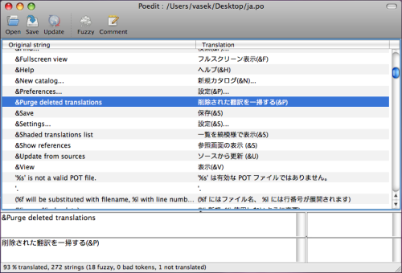

Scaposer is a GNU gettext po file parser written in Scala.
It's strange that there's not many JVM libraries of this kind, see the
`discussion on Stackoverflow <http://stackoverflow.com/questions/4635721/is-there-a-java-library-for-parsing-gettext-po-files>`_.

To extract i18n strings from Scala source code files, use
`Scala xgettext <https://github.com/xitrum-framework/scala-xgettext>`_.

Discussion group: https://groups.google.com/group/scala-xgettext

Basic usage
-----------

See `Scaladoc <http://xitrum-framework.github.io/scaposer/>`_.

::

  val string = """
  msgid "Hello"
  msgstr "Bonjour"
  """

  val poo = scaposer.Parser.parsePo(string)  // => An Option[scaposer.Po] (None on failure)

Use ``t`` methods to get the translations:

::

  val po = poo.get // => A scaposer.Po
  po.t("Hello")    // => "Bonjour"

If there's no translation, the input is returned:

::

  po.t("Hi")  // => "Hi"

To take out the map of all translations (to save into DB etc.), call ``po.body``.

Context
-------

::

  val string = """
  msgid "Hello"
  msgstr "Bonjour"

  msgctxt "Casual"
  msgid "Hello"
  msgstr "Salut"
  """

  val po = Parser.parsePo(string).get
  po.t("Casual", "Hello")  // => "Salut"

If there's no translation for the context, the translation without context is tried:

::

  po.t("Missing context", "Hello")  // => "Bonjour"

Plural-Forms
------------

Your po file must define ``Plural-Forms`` exactly as at:

* http://www.gnu.org/software/gettext/manual/html_node/Plural-forms.html#Plural-forms
* http://www.gnu.org/software/gettext/manual/html_node/Translating-plural-forms.html#Translating-plural-forms

Scaposer does not evaluate the ``plural`` expression, which is in C language.
It just removes spaces in the expression and performs string comparison. See
`evaluatePluralForms <https://github.com/xitrum-framework/scaposer/blob/master/src/main/scala/scaposer/Po.scala>`_.

::

  val string = """
  msgid ""
  msgstr "Plural-Forms: nplurals=2; plural=n>1;"

  msgid "I have one apple"
  msgid_plural "I have %d apples"
  msgstr[0] "J'ai une pomme"
  msgstr[1] "J'ai %d pommes"
  """

  val po = Parser.parsePo(string).get
  po.t("I have one apple", "I have %d apples", 1)
  po.t("I have one apple", "I have %d apples", 2)
  po.t("A context", "I have one apple", "I have %d apples", 3)

Merge Po objects
----------------

You can merge ``Po`` together.

::

  val po4 = po1 ++ po2 ++ po3

Just like when you merge maps, translations in po3 will overwrite those in po2
will overwrite those in po1.

Use with SBT
------------

Supported Scala versions: 2.11.x, 2.10.x

build.sbt example:

::

  libraryDependencies += "tv.cntt" %% "scaposer" % "1.3"

Scaposer is used in `Xitrum <https://github.com/xitrum-framework/xitrum>`_.
